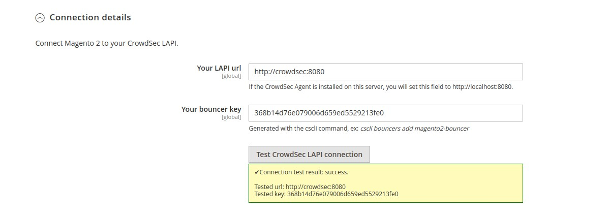
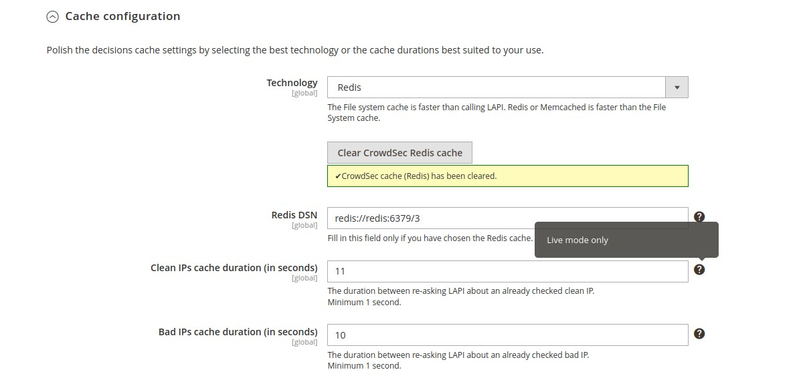

# CrowdSec Bouncer extension for Magento 2
----------------------------------------------

## User Guide

---------------------------------------------

<!-- START doctoc generated TOC please keep comment here to allow auto update -->
<!-- DON'T EDIT THIS SECTION, INSTEAD RE-RUN doctoc TO UPDATE -->
**Table of Contents**

- [Description](#description)
- [Prerequisites](#prerequisites)
- [Usage](#usage)
  - [Features](#features)
  - [Configurations](#configurations)
    - [General Settings](#general-settings)
    - [Theme customizations](#theme-customizations)
    - [Advanced settings](#advanced-settings)

<!-- END doctoc generated TOC please keep comment here to allow auto update -->

### Description

The `CrowdSec_Bouncer` extension for Magento 2 has been designed to protect Magento 2 hosted websites from all kinds of attacks.

### Prerequisites

To be able to use this blocker, the first step is to install [CrowdSec v1](https://doc.crowdsec.net/Crowdsec/v1/getting_started/installation/).

Please note that first and foremost CrowdSec must be installed on a server that is accessible via the Magento 2 site. 
Remember: 
> CrowdSec detects, bouncers deter.

### Usage

#### Features

When a user is suspected to be malevolent, CrowdSec will either send him/her a Captcha to resolve or simply a page notifying that access is denied. 

Please note that it is possible to customize all the colors of these pages in a few clicks so that they integrate best with your design. 

On the other hand, all texts are also fully customizable. This will allow you, for example, to present translated pages in your users’ language.

#### Configurations

This module comes with configurations that you will find under `Stores → Configurations → Security → CrowdSec Bouncer` admin section.

These configurations are divided in three main parts : `General Settings`, `Theme customizations` and `Advanced settings`.

##### General Settings

  In the `General settings` part, you will set your connection details and refine bouncing according to your needs.
  

***

 * `Connection details → Your LAPI Url` (`global` scope) : Url to join your CrowdSec LAPI
 
***
 
 * `Connection details → Your bouncer key` (`global` scope) : Key generated by the cscli command
 
 ***

**N.B** : Even before saving configuration, you can check if your settings are correct by clicking on the test button.

***

 * `Bouncing → Enable bouncer on Frontend area` (`store view` scope) : Choose which store views you want to protect
 
***

***

 * `Bouncing → Enable bouncer on Adminhtml area` (`global` scope) : Choose if you want to protect admin too
 
***

***

 * `Bouncing → Enable bouncer on API areas` (`global` scope) : Choose if you want to protect REST, SOAP and GraphQL endpoints
 
***

**N.B** : For API calls, there will be no ban or captcha wall. User will receive a `401` (ban) or `403` (captcha) response code.

***

 * `Bouncing → Bouncing level` (`store view` scope) : Choose if you want to apply CrowdSec directives (Normal bouncing) or be more permissive (Flex bouncing).
 
***

##### Theme customizations

 In the `Theme customizations` part, you are able to modify texts and colors of ban and captcha walls. All fields here are store view scoped, so you can use different languages and designs.

##### Advanced settings

  

 
